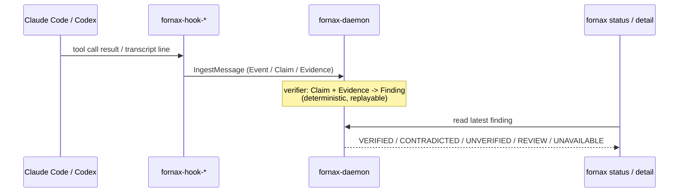

# Start here: scenarios

Three realistic, runnable scenarios — pick the one closest to what you're
actually doing. Each one is real command output from a fresh
`$FORNAX_HOME`, not a mockup. If you only try one thing, make it
[Scenario 1](#scenario-1-catch-a-false-tests-passed-claim).

:::note[What's genuinely runnable today]
All three scenarios use `status`/`detail`/`export-spool` and the Claude
Code/Codex adapters — shipped on the public `main` branch (`v0.0.1`). None
of them use `capabilities`, `install-claude`/`install-codex`, the OpenCode
adapter (all real but on the not-yet-tagged `v0.0.3` line), or
`evidence-graph`/`fusion`/`decision`/`judge`/`reliability`/`experiment`
(planned, `v0.0.4`, not runnable at all). See [Maturity](./why-fornax.md#maturity).
:::

:::warning[Stop each daemon before starting the next scenario]
`fornax-daemon`'s HTTP API always binds `127.0.0.1:4317`, regardless of
`$FORNAX_HOME` — only the Unix socket and database path are scoped per
`$FORNAX_HOME`. If you start a new scenario's daemon while a previous
one is still running, the new daemon fails to bind (logged, not shown to
you) and **`fornax status`/`detail` will silently show the previous
scenario's stale verdict** instead of an error. Kill each scenario's
daemon (each scenario's Cleanup step says exactly how) before starting
the next one. To run more than one at once instead, set a distinct
`FORNAX_HTTP_PORT` for each (e.g. `FORNAX_HTTP_PORT=4318`) — see
FORNX-339 for the underlying limitation.
:::

## How this fits together



Everything below reads/writes under `$FORNAX_HOME` (default `~/.fornax`) —
an on-disk SQLite DB, a Unix socket, a localhost HTTP API. Nothing leaves
your machine in any of these scenarios.

---

## Scenario 1: catch a false "tests passed" claim

**Persona**: a solo developer running Claude Code on a real repo, who
wants a check on the agent's own claims without reviewing every diff by
hand.

**Starting situation**: the agent just ran a command, then told you the
work is done and tests pass. You'd like to know if that's actually true
before you act on it.

**Why Fornax**: this is the exact failure mode Fornax exists for — a
claim generated by the same model that did the work, checked against
evidence captured independently of that claim.

**Preconditions**: `cargo build --workspace` succeeded; `fornax-daemon`
and `fornax-hook-claude` are on `PATH` or referenced by full path.

**Exact starting point**: a clean scratch `$FORNAX_HOME` (never point this
at a real install while experimenting).

**Required inputs**: none beyond the built binaries — this scenario
simulates the hook payloads by hand so you don't need a live Claude Code
session to see the result.

**Command flow**:

```bash
export FORNAX_HOME=/tmp/fornax-quickstart
rm -rf "$FORNAX_HOME"
./target/debug/fornax-daemon &

SESSION=quickstart-demo
echo '{"hook_event_name":"PostToolUse","session_id":"'"$SESSION"'","tool_name":"Bash","tool_input":{"command":"npm test"},"tool_response":{"exit_code":1,"stdout":"","stderr":"3 failed, 12 passed"}}' \
  | ./target/debug/fornax-hook-claude

cat > /tmp/fornax-transcript.jsonl <<'EOF'
{"type":"assistant","message":{"content":[{"type":"text","text":"All tests passed, the fix is complete."}]}}
EOF
echo '{"hook_event_name":"Stop","session_id":"'"$SESSION"'","transcript_path":"/tmp/fornax-transcript.jsonl"}' \
  | ./target/debug/fornax-hook-claude

./target/debug/fornax status
./target/debug/fornax detail
```

**Expected intermediate state**: the daemon has recorded one `PostToolUse`
event (exit code 1), one claim ("All tests passed..."), no crash/error on
either hook invocation.

**Expected final result** (real output, captured 2026-09-06):

```
🛡 ✕ CONTRADICTED
  claim:     All tests passed, the fix is complete.
  rationale: claim states tests passed, but observed test-runner exit_code=1 (claude_code:PostToolUse:Bash#tool_response)
  verifier:  test_result_verifier_v1
  when:      2026-09-06T14:17:09.637732+00:00
```

**How to verify success**: `fornax status` prints `CONTRADICTED`, and
`fornax detail`'s rationale names the real exit code (1) — not a made-up
number. Re-running with `"exit_code":0` and no claim contradiction should
instead yield `VERIFIED`.

**Common gotchas**: no capabilities ever declared ⇒ every claim resolves
`UNAVAILABLE` regardless of evidence — you must send the `PostToolUse`
event before the `Stop` event, and a real Claude Code hook install
declares capabilities on `SessionStart` automatically (see
[Installing the Claude Code integration](./claude-code-integration.md)).

**Cleanup**: `pkill -f fornax-daemon` (or kill the specific PID), then `rm -rf "$FORNAX_HOME"` -- do this before starting the next scenario, see the warning above.

**Going deeper**: this is a simplified replay of a real, reproduced
incident — see [First finding walkthrough](./first-finding-walkthrough.md)
for the full story, including two real adapter bugs this exact scenario
caught during development.

---

## Scenario 2: verify a Codex session's claim

**Persona**: a developer using the Codex CLI instead of Claude Code, who
wants the same kind of check.

**Starting situation**: Codex's hook system is opt-in and can be
admin-disabled, so Fornax's Codex adapter doesn't depend on it — it tails
Codex's own always-on rollout JSONL transcript instead
(`~/.codex/sessions/**/*.jsonl`).

**Why Fornax**: same value as Scenario 1, different transport. Codex's
adapter is asymmetric with Claude Code's in one important way — see the
gotcha below before you rely on it for contradiction detection.

**Preconditions**: `fornax-daemon` and `fornax-hook-codex` built.

**Exact starting point**: a clean scratch `$FORNAX_HOME`, a hand-built
rollout file (a real Codex session writes this automatically — this
scenario constructs one so you can see the shape without running Codex).

**Required inputs**: none beyond the built binaries.

**Command flow**:

```bash
export FORNAX_HOME=/tmp/fornax-codex-demo
rm -rf "$FORNAX_HOME"
./target/debug/fornax-daemon &

ROLLOUT=/tmp/codex-rollout.jsonl
SESSION=codex-demo
cat > "$ROLLOUT" <<EOF
{"type":"response_item","payload":{"session_id":"$SESSION"}}
{"type":"response_item","payload":{"type":"custom_tool_call","call_id":"call_1","name":"exec","input":"{\"cmd\":[\"bash\",\"-lc\",\"pytest\"]}"}}
{"type":"response_item","payload":{"type":"custom_tool_call_output","call_id":"call_1","output":[{"text":"12 passed in 1.02s\nScript completed"}]}}
{"type":"event_msg","payload":{"type":"task_complete","last_agent_message":"All tests passed, ready to merge."}}
EOF

./target/debug/fornax-hook-codex --file "$ROLLOUT" &
sleep 2
./target/debug/fornax status
./target/debug/fornax detail
```

**Expected intermediate state**: `fornax-hook-codex` prints `tailing
/tmp/codex-rollout.jsonl` to stderr and stays running (it polls the file
every 500ms — a real session's file grows as Codex writes to it).

**Expected final result** (real output, captured 2026-09-06):

```
🛡 ✓ VERIFIED
  claim:     All tests passed, ready to merge.
  rationale: observed test-runner exit_code=0 (codex:rollout:custom_tool_call_output#heuristic:script_completed)
  verifier:  test_result_verifier_v1
  when:      2026-09-06T14:18:11.679297+00:00
```

**How to verify success**: `fornax detail`'s rationale cites the
`script_completed` heuristic explicitly — this is honest about being a
text-marker heuristic, not a literal exit code (unlike Claude Code's
`tool_response.exit_code` field).

**Common gotchas — read this before trusting Codex contradiction
detection**: as of this adapter version, the only confirmed success
marker is the literal string `"Script completed"` in the tool output. A
confirmed *failure*-path text marker has not yet been captured from a
real Codex session (tracked as a residual follow-up) — so an unrecognized
output shape produces **no evidence at all**, not a guessed
`CONTRADICTED`. Practically: today, Codex verification is stronger at
confirming a true "it worked" claim than at catching a false one. Claude
Code's `PostToolUse` adapter (Scenario 1) has a real literal exit code and
does not share this asymmetry.

**Cleanup**: `pkill -f fornax-daemon; pkill -f fornax-hook-codex`, then
`rm -rf "$FORNAX_HOME"` — do this before starting the next scenario, see
the warning above.

**Going deeper**: [Codex integration](./codex-integration.md).

---

## Scenario 3: export a session's evidence for a teammate or cloud sync

**Persona**: a developer who wants to hand a session's evidence to someone
else — a teammate reviewing what an agent actually did, or a sync target
like `fornax-cloud` — instead of re-explaining it from memory or pasting a
transcript.

**Starting situation**: you have a local session (e.g. Scenario 1's) with
real events/claims/evidence recorded, and need to move it somewhere else.

**Why Fornax**: this is Fornax's actual handoff primitive today.

:::info[What do you give the other party — be exact]
**There is no peer-to-peer "share this session" feature and no persistent
contact/address-book concept in Fornax today.** The one implemented
handoff artifact is what `fornax export-spool` writes: a directory of
wire-compatible envelope JSON files, one per event/claim/evidence/
capabilities record, under `<out>/pending/<uuid>.json`. What you actually
hand the other party is **that directory path** (or its contents, however
you transfer them — shared filesystem, archive, upload). The receiving
side is `fornax-uploader`'s `FORNAX_UPLOADER_SPOOL_DIR`, pointed at the
same directory, which is how `horonomy/fornax-cloud` picks it up. There is
no token/URL/session-ID exchange beyond "here is this directory" — cloud
sync itself is opt-in and off by default (`FORNAX_CLOUD_SYNC_ENABLED`).
:::

**Preconditions**: a session with recorded data (e.g. run Scenario 1
first against the same `$FORNAX_HOME`).

**Exact starting point**: the `$FORNAX_HOME` from Scenario 1, daemon may
be stopped — `export-spool` reads `fornax.db` directly.

**Required inputs**: the session id (`quickstart-demo` if continuing from
Scenario 1) and an output directory.

**Command flow**:

```bash
export FORNAX_HOME=/tmp/fornax-quickstart   # from Scenario 1
./target/debug/fornax export-spool --session quickstart-demo --out /tmp/fornax-uploader-spool
```

**Expected final result** (real output, captured 2026-09-06):

```
exported session quickstart-demo: 2 event(s), 1 claim(s), 1 evidence, 1 capabilities -> /tmp/fornax-uploader-spool/pending
```

Each file is a flat JSON object tagged with a `"type"` field
(`"event"`/`"claim"`/`"evidence"`/`"capabilities"`) — e.g. a claim file
looks like:

```json
{"claimed_at":"2026-09-06T14:17:09.636825+00:00","id":"20cc20f0-...","session_id":"quickstart-demo","source_event_id":"88521fe6-...","subject":"test_result","text":"All tests passed, the fix is complete.","type":"claim"}
```

**How to verify success**: `ls <out>/pending/` shows 5 files — 2 events,
1 claim, 1 evidence, 1 capabilities — matching the printed count line.
`fornax-hook-claude` records an implicit capabilities entry on the very
first message it handles, even for a hand-simulated session like
Scenario 1's with no explicit `SessionStart` — so the capabilities file
shows up here too, not only for a real Claude Code install.

**Common gotchas**: a `capabilities` file is only ever *absent* from the
export when the session has zero capabilities announcements on record at
all (FORNX-62) — in practice that's rare once any hook has run. This
command works with the daemon stopped — it reads the SQLite file
directly, no socket involved.

**Security/privacy note**: the exported files contain whatever was
captured — tool inputs/outputs, transcript claim text. Nothing is redacted
by `export-spool` itself; review [Privacy & Redaction](./privacy-redaction.md)
for what the capture path filters before it's ever written, and don't
hand this directory to a party you wouldn't show that data to.

**Cleanup/reversal**: delete the export directory when done — it's a
plain copy, not a moved/consumed source. The original session in
`$FORNAX_HOME` is untouched.

**Going deeper**: [Export a session for cloud sync](./export-spool.md).

---

## Why not a fourth scenario?

OpenCode's adapter is real but PARTIAL (manual plugin setup, narrower
event coverage — see [OpenCode integration](./opencode-integration.md)); a
fourth scenario there would mostly repeat Scenario 1/2's shape with more
setup steps and less confirmed behavior, not teach something new. The
`v0.0.4` capabilities (evidence-graph, fusion, decision, judge,
reliability, experiment) aren't runnable at all yet — a scenario using
them would have to fabricate output. Three genuinely-different, genuinely-
runnable scenarios is the honest count today.

## Usage guidelines

**Choosing `status` vs `detail` vs `capabilities`**: `status` is the
one-line answer for a status-line segment or a quick check. `detail` is
what you read when `status` isn't `VERIFIED` and you want the rationale.
`capabilities` (v0.0.3 line — see [Capabilities](./capabilities.md)) is
for debugging *why* a check came back `UNAVAILABLE` — which signal the
runtime never announced this session.

**Minimal safe input**: always set `FORNAX_HOME` to a scratch directory
while experimenting (`export FORNAX_HOME=/tmp/fornax-scratch`). A real
install defaults to `~/.fornax` and accumulates real session history —
fine for daily use, not what you want while trying scenarios from this
page.

**Demo/scratch vs. production**: everything above uses a throwaway
`$FORNAX_HOME`. For daily use, drop the `export FORNAX_HOME=...` line
(use the default `~/.fornax`) and install the real hooks —
`fornax install-claude` (v0.0.3 line) or manual wiring for Codex — instead
of hand-feeding JSON on stdin.

**Troubleshooting decision tree**:

- **No verdict shows up at all** → is `fornax-daemon` running? (`fornax
  status` needs the daemon's socket/HTTP API up.)
- **Verdict is always `UNAVAILABLE`** → capabilities were never declared
  for this session — see Scenario 1's gotcha; a real Claude Code
  `SessionStart` hook fixes this automatically.
- **Hooks don't seem to fire in a real Claude Code session** → confirm
  `fornax install-claude` actually ran (v0.0.3 line) and `fornax-hook-claude`
  is on `PATH`; see [Troubleshooting](./troubleshooting.md).
- **Codex verdict never becomes `CONTRADICTED`, only `VERIFIED` or
  nothing** → expected today, see Scenario 2's gotcha — the failure-path
  heuristic isn't confirmed yet.
- **`export-spool` says 0 events** → check you're pointing `$FORNAX_HOME`
  at the directory that actually has the session, and the session id is
  spelled exactly as it was recorded.

See [Troubleshooting](./troubleshooting.md) for more.
